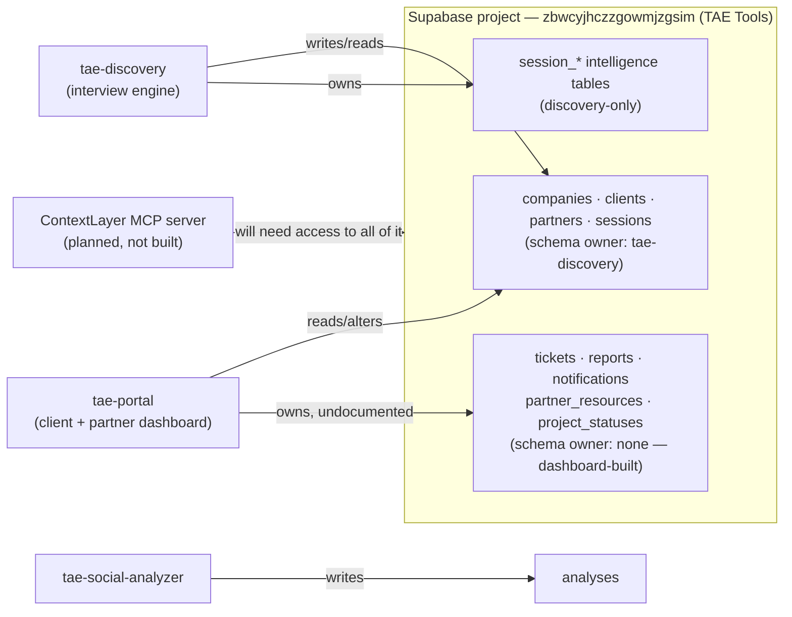
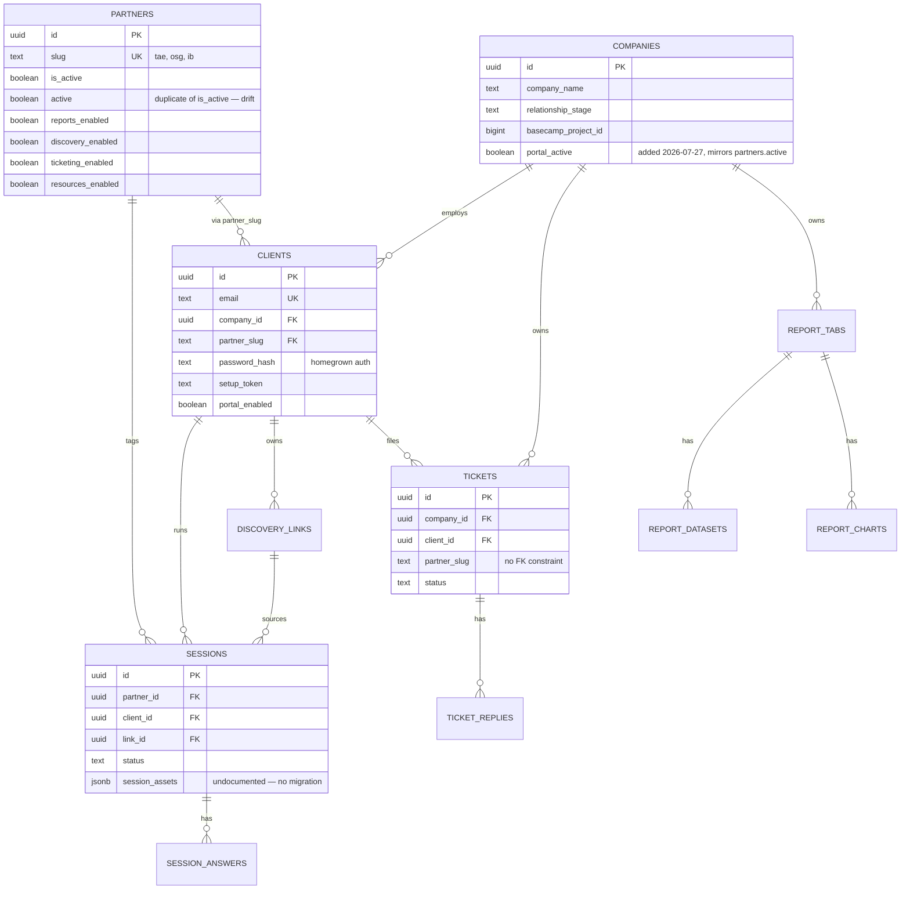

<!-- title: TAE Tools — Supabase Database Audit -->

# TAE Tools — Supabase Database Audit

*CLI linked and cross-checked against the live database (project `zbwcyjhczzgowmjzgsim`, "TAE Tools", Postgres 17) via `supabase gen types` and `supabase db advisors` — Supabase's own security/performance linter. Everything below is confirmed against what's actually running, not inferred from files. Originally written July 23, 2026; updated July 27, 2026 (tae-portal migration discipline now actually working — see finding 5 update), then again July 27, 2026 (a real cross-repo migration-numbering collision surfaced and got fixed — see finding 5's second update), then again July 31, 2026 (the collision turned out to involve a third repo, `tae-contextlayer`, not two — see finding 5's third and fourth updates and the new `contextlayer` schema section).*

---

## Status: security fixes and migration reconstruction are done

Everything flagged as ERROR-severity in the original version of this audit has been fixed and verified — RLS is on everywhere it should be, the backfill function is locked down, the two admin views no longer bypass security, and two mislabeled policies now actually do what their names claim. Every fix was checked against tae-portal's real source code first and confirmed live afterward (anon-key reads still return 200, anon-key writes that shouldn't be allowed now correctly return 401). The migration files also now match live reality in both repos — including tae-portal's very first migration file, ever. Details in each finding below, marked **✅ Fixed**.

What's left is purely organizational: deciding an ownership convention between the repos sharing this project (three now, not two — see finding 5's fourth update), and moving from one flat namespace to something built for "vast and complex" (the schema-namespacing recommendation) — see **What's left to do**.

---

## The one-sentence version

One Supabase project quietly became the backend for four tools. Twelve of its tables had **row-level security switched off entirely** — not permissive, actually off — which Supabase's own linter flagged as its highest-severity error; that's now fixed. Two apps (tae-discovery and tae-portal) still share and independently alter the same core tables with no coordination file between them. And a couple of live columns exist that no migration file in either repo explains.

None of this was a crisis — it's what happens when four tools get built fast, borrowing the nearest working database.

---

## System map

**Term check:** an *anon key* is the public, client-safe API key Supabase issues per project — safe to embed in a browser only when row-level security actually restricts what it can touch. A *service role key* bypasses that restriction entirely and should only ever live in a server environment, never in HTML shipped to a browser.

---

## Findings & fault lines

Ranked by severity, per Supabase's own linter output where applicable — not by how they were discovered.

### 1. Twelve tables had row-level security completely disabled — ✅ Fixed

This wasn't "wide open by policy" — it was more direct than that. RLS was never turned on for these tables, so there was no policy layer at all between the public API and the rows:

`analyses` · `ticket_replies` · `partner_files` · `feed_views` · `notification_subscriptions` · `notification_queue` · `published_assets` · `project_statuses` · `report_datasets` · `report_tabs` · `report_charts` · `partner_resources`

**Term check:** RLS is Postgres's row-by-row permission gate. "Disabled" meant Supabase's public API (PostgREST) would serve every row in that table to anyone holding the anon key — read *and* write — with nothing checking who's asking. This list included ticket replies, client report data, and notification content: the parts of tae-portal that read as most clearly client-facing.

**Fixed:** RLS is now on for all twelve, with the same `using (true)` policy pattern the rest of the schema already uses (migration `007_rls_hardening.sql`). Verified against `supabase db advisors` — zero ERROR-level findings remain — and against the live API directly (anon-key reads that need to keep working still return 200).

### 2. Two SECURITY DEFINER views + one admin function were callable by anyone — ✅ Fixed

`session_context` and `session_summary` (the two admin-dashboard views from tae-discovery's migration 006) were marked `SECURITY DEFINER`, meaning they ran with their *creator's* permissions, not the caller's — bypassing RLS on the tables underneath regardless of who was asking. **Fixed:** switched to `security_invoker = true` (a Postgres 15+ option, no drop/recreate needed).

Separately, `backfill_normalized_intelligence()` — the one-time data-migration function from that same migration — was directly callable over the public REST API by the anon key, no login required, letting anyone re-trigger a full backfill on demand. **Fixed:** revoked execute from `public` (not just `anon`/`authenticated` — Postgres grants EXECUTE to `PUBLIC` by default, so the first attempt at this fix didn't fully take until `public` itself was revoked too; verified against the linter afterward). `increment_link_stat()` was deliberately left alone — it's actively used for discovery-link click/start/completion tracking via the anon key, and that's intentional.

Both functions still carry a "mutable search_path" warning — a minor, lower-priority Postgres hardening gap, not yet addressed.

### 3. Everything else that has RLS is wide open by explicit design — mostly still true, two exceptions now fixed

Every table with RLS on — `sessions`, `companies`, `clients`, `discovery_links`, `partners`, `fri_comments`, and all the `session_*` tables — has insert/update/delete policies reading `using (true)`. The original schema file leaves an honest comment on this exact line: `-- tighten this once you add auth`. This tier is a reasonable stage-one default for a lead-magnet interview tool with no login system; it stops being reasonable once the same project holds `companies`, `tickets`, and report data for four paying accounts — see the RLS-tightening recommendation below.

**`client_features` and `tickets` — ✅ Fixed.** Both had a single policy named "Service role full access" that was actually scoped to `public`, not `service_role` — meaning the anon key could insert/update/delete on both tables despite the name. Checked against tae-portal's real source first: every anon-key read of these two tables (the client portal page, the admin client-detail page) is select-only; every write already went through server-side code using the service role. So this was a straight tightening, not a risk — split into a public `select` policy (reads keep working) and a `service_role`-only policy for everything else (writes now actually restricted, verified: anon-key insert attempt now returns 401 instead of succeeding).

### 4. The "two authentication systems" finding — corrected, not actually an issue

The original version of this audit claimed tae-portal's code referenced `.from('profiles')` and `.from('users')` tables that don't exist, implying dead code from an abandoned auth system. **That was wrong** — it was based on a grep that hadn't fully excluded a bundled `@supabase/postgrest-js` test-fixtures file, which uses exactly those table names among its fake data. Re-checked against real app source only: the login flow (`app/api/auth/login`, `setup-password`, `me`) is built entirely on `clients.password_hash`/`setup_token` (bcrypt-based), and nothing in the codebase references `.from('profiles')`, `.from('users')`, or any `supabase.auth.*` call at all. `auth.users` (Supabase's built-in system) exists because Supabase provisions it automatically, but it's simply unused — not a competing system, nothing to decide, nothing to delete.

### 5. Live schema had drifted ahead of the migration files — ✅ Fixed (documentation)

*(Original finding text below, kept for context — see the fix note that follows it.)*

Not just tae-portal. tae-discovery's own live schema has columns with no migration record: `discovery_links.archived` and `discovery_links.partner_slug` (with a real foreign key to `partners.slug`), and `sessions.session_assets` (jsonb). None of the six numbered migrations add these. `partners` has grown even further live — `discovery_link_id`, `branding`, `logo_svg`, `logo_url`, `partner_type`, and a **second, separate `active` boolean sitting alongside the original `is_active`** — two flags that read as the same concept, likely added independently by two different people at two different times.

The practical read: even tae-discovery, the repo with real migration discipline, has been edited live in the dashboard for anything that felt small in the moment. The fix isn't "stop doing that" — dashboard edits for a one-off column are fine — it's capturing them in a migration file afterward so the files stay trustworthy.

**Fixed:** Two new files, both pure documentation (idempotent, verified as true no-ops against the live database):
- `tae-discovery/supabase/migrations/009_reconstruction_drift.sql` — documents the drifted columns above, including flagging the `active`/`is_active` duplicate for a future decision rather than silently resolving it.
- `tae-portal/supabase/migrations/001_reconstruction.sql` — tae-portal's **first migration file ever**. Documents all 13 tables it owns (`tickets`, `ticket_replies`, `report_tabs`, `report_datasets`, `report_charts`, `project_statuses`, `published_assets`, `client_features`, `partner_resources`, `partner_files`, `notification_queue`, `notification_subscriptions`, `feed_views`) — every column, type, default, and constraint pulled directly from `information_schema`/`pg_constraint` against the live database, not guessed from application code.

tae-portal still has no ongoing migration *discipline* — this is a snapshot, not a process. The next schema change to any of these 13 tables should get a new numbered migration file rather than another dashboard edit, or this gap reopens immediately.

**Update, 2026-07-27 — the predicted gap reopened almost immediately, and the fix is now real.** A new client-facing feature (Dashboard Resources) added `'resources'` as a valid `client_features.feature_key` value in the TypeScript type, but the table's `check` constraint — which only exists in the database, not in any type — was never updated to match. Every attempt to enable it for a client failed silently at the DB layer while the UI's optimistic update briefly showed success. This is exactly the failure mode finding 5 predicted: a live constraint drifting ahead of what the app code assumes, caught only by testing the actual toggle, not by any type check.

Fixed properly this time, not just patched: `supabase link`, then `supabase migration repair 001 002 003 004 --status applied --linked` (the four reconstruction-snapshot migrations existed as files but had no remote ledger entry — repair marks them applied without replaying them), then real numbered migrations pushed via `supabase db push`: `005_client_resources_files.sql`, `006_company_portal_active.sql`, `007_client_features_add_resources.sql` (the constraint fix itself). tae-portal's migration history is now genuinely tracked against the remote database for the first time — `supabase migration list` shows local/remote in sync — so the next schema change can go through the same `db push` flow instead of a dashboard edit that drifts again.

**A second, more serious instance surfaced in the same session — the two new tables from migration 005 (`client_resources`, `client_files`) had no RLS at all.** `create table` was written with no `enable row level security` and no policy — the exact class of gap finding 1 fixed for twelve other tables, reintroduced by a brand-new migration the same day. Not inferred: confirmed live by probing with the actual anon key before touching anything — an unauthenticated `POST` to `client_resources` with a real `company_id` succeeded (`201`, row created and immediately visible), proving both read and write were fully open to anyone holding the public anon key. Probe row deleted immediately after confirming. **Fixed** via `008_client_resources_files_rls.sql` — RLS enabled on both tables with the same `using(true)` permissive policy every other `portal.*` table currently uses; re-checked against `supabase db advisors` afterward, zero findings for either table. Net effect: both tables now sit at the same permissive-but-present posture as their siblings (`partner_resources`/`partner_files`), not fully open and not yet tightened — same caveat as everything else in this tier.

**A third instance, same day, and this one is the "no ownership convention" gap turning into an active bug, not just a style critique.** tae-portal and tae-discovery are two separate git repos, each with their own `supabase/migrations` folder — but they `supabase link` to the *same* project, meaning there is exactly one `supabase_migrations.schema_migrations` ledger table shared between them. Both repos independently numbered their own migrations 001 upward, and both happened to reach `010` around the same time — tae-discovery's real `010_discovery_schema_pilot.sql` landed in the shared ledger first. When tae-portal's own (unrelated) `010_cl_cadence_tasks.sql` was pushed, `supabase db push` silently treated version `010` as already satisfied — no error, no new tables, the push just no-op'd. Caught immediately by checking for the new tables directly afterward rather than trusting the CLI's success output; `cl_tasks` didn't exist. **Fixed** two ways: (1) tae-portal's actual migration was renumbered to `020` — well clear of tae-discovery's current sequence — and pushed cleanly, confirmed live; (2) a small no-op placeholder file, `010_shared_ledger_placeholder_discovery_schema_pilot.sql`, was added to tae-portal's migrations folder purely so its local file list has an entry matching the shared ledger's `010` row — it makes no schema changes, it exists only so `supabase migration list` reads as consistent from tae-portal's side too.

This is exactly the risk the "decide the ownership convention" recommendation (below, still unstarted) was written to prevent, now with a concrete failure mode attached: **any two repos sharing one Supabase project, numbering migrations independently, will eventually collide, and the collision fails silently rather than loudly.** Until an ownership convention exists, the safe habit is checking `supabase migration list` from whichever repo you're about to push from *before* trusting the push succeeded — and verifying the actual object exists afterward, not just reading "Finished supabase db push" as confirmation.

**A fourth instance, discovered while fixing the third — turns out it's not two repos sharing this project, it's three, and the collision claimed a casualty on the way in.** `tae-contextlayer` also links to `zbwcyjhczzgowmjzgsim` and has its own `supabase/migrations` folder, independently numbered, which had *already* reached `014` by the time the third instance above was being diagnosed (`011_industry_aliases.sql` through `014_account_owners.sql` — real, applied, verified-live migrations per `TAE_ContextLayer.md`'s own status updates). While repairing tae-portal's view of the ledger for the third instance, `supabase migration repair --status reverted 011 012 013 014` was run **from tae-portal's directory**, against what looked like four orphaned, unexplained remote entries. They were not orphaned — they were tae-contextlayer's real work, and "reverted" is a shared-ledger-wide status change, not scoped to the repo running the command. This briefly left the shared ledger claiming four genuinely-applied, actively-used migrations were reverted, which they were not.

**Caught and fixed before it caused any real harm** — by checking `tae-contextlayer`'s own migrations folder directly (its 001–009 are literal duplicates of tae-portal's own reconstruction migrations, confirming the two repos really do share history; 010–014 are its real, contextlayer-specific work) and re-running `supabase migration repair --status applied 011 012 013 014`, this time from `tae-contextlayer`'s own directory, restoring the ledger to reality. No data was touched — `repair` only ever edits the ledger's bookkeeping, never runs or reverts actual SQL — but the ledger briefly *said* something false about production migrations, which is exactly the kind of drift this document exists to catch. Verified after the fix: `tae-contextlayer`'s own `supabase migration list` shows all of 001–015 as `local` matching `remote`, no gaps, no phantom entries.

The corrected total: **three repos** (`tae-portal`, `tae-discovery`, `tae-contextlayer`) share one Supabase project and one migration ledger, not two. Every recommendation below about ownership and collision risk applies across all three, not two — and the practical lesson sharpens further: before repairing *any* unexplained remote-only ledger entry, check whether a third (or fourth) repo you haven't opened yet might be the real owner, rather than assuming it's noise.

**A fifth instance, 2026-08-01 — same collision, again, which settled the open recommendation below.** Renumber-and-placeholder had already happened three separate times (the updates above) and kept recurring, because the underlying scheme — three repos each counting `001, 002, 003...` independently against one shared ledger — guarantees a future collision every time any two of them reach the same number around the same time. That's not a bug to keep patching, it's the scheme itself being wrong for three independent counters against one shared resource. Fixed structurally instead of patched again: **each repo now owns a permanently reserved numeric block, so collision is no longer possible, not just less likely.**

- `tae-portal` → `100–199` — new migrations named `100_tp_<description>.sql`, `101_tp_<description>.sql`, etc.
- `tae-discovery` → `200–299` — `200_td_<description>.sql`, etc.
- `tae-contextlayer` → `300–399` — `300_tcl_<description>.sql`, etc.
- `400+` reserved for any future repo that ever links to this same project (`zbwcyjhczzgowmjzgsim`).

Every block starts well clear of anything any repo has claimed so far (highest real numbers as of this fix: tae-portal 021, tae-discovery 010, tae-contextlayer 022) — no renumbering of existing files, no ledger repair, nothing retroactive. This applies going forward only: the next migration in any of the three repos should jump straight to its block's starting number rather than continuing the old shared 001-up sequence. The 2–3 letter tag in the filename (`tp`/`td`/`tcl`) is purely for human legibility when scanning a `migrations/` folder — the number itself is what makes collision structurally impossible, since no other repo will ever count into another's block. Pinned in each repo's own `AGENTS.md` so it loads into context automatically, including for background/subagent sessions.

### 6. fri-marketing-redesign's key in public HTML — ✅ Fixed (separately, before this list)

The F.R.I. marketing site was moved to its own Vercel project and rebuilt with no Supabase connection at all — verified directly against the live deployment. The `fri_comments` table itself was dropped from the database, not just disconnected. Resolved before the RLS work above even started.

---

## What's actually well-built here

Worth naming, since an audit that's all findings reads as more broken than it is: tae-discovery's migration 006 (`session_answers`, `session_mis_scores`, `session_service_fit`, and eight more tables) is genuinely well-designed schema work. It normalizes what used to be opaque JSONB blobs into real queryable tables, keeps the JSONB as a dual-write fallback so nothing broke during the transition, uses extensible `text` type/category columns instead of new tables for future variants, and ships an idempotent backfill function with a `session_context` view that gives any future AI agent a single flat, labeled query for a session's full picture. That's the pattern worth extending to the rest of the database — the SECURITY DEFINER / public-RPC issues that came with it have since been fixed (finding 2).

---

## Core entity relationships (confirmed live)

---

## Full table inventory

39 tables total across four app-owned groups plus the two intelligence-only schemas already covered above. (`fri_comments` — listed in the original version of this audit — was dropped along with the fri-marketing anon-key fix, finding 6. `client_resources` and `client_files` added 2026-07-27, mirroring `partner_resources`/`partner_files`. The `contextlayer` schema — 7 tables, `tae-contextlayer`'s own — is new to this table since the last update; see its own section directly below.)

| Table | Owner (by evidence) | RLS status | Purpose |
|---|---|---|---|
| `partners` | tae-discovery, altered by tae-portal | on, permissive | TAE/OSG/IB. Carries per-partner feature toggles used by tae-portal. Has duplicate `active`/`is_active` flags. |
| `companies` | tae-discovery | on, permissive | Client organizations. Basecamp project/vault IDs. |
| `clients` | tae-discovery, altered by tae-portal | on, permissive | Contacts. Also carries tae-portal's homegrown login fields (`password_hash`, `setup_token`, `portal_enabled`, `role`) — this is the one real auth system (finding 4). |
| `sessions` | tae-discovery | on, permissive | One Discovery interview run. Core spine of the system. |
| `discovery_links` | tae-discovery | on, permissive | Trackable outreach links. `archived`/`partner_slug` exist live with no migration. |
| `session_answers` | tae-discovery | on, permissive | Normalized Q&A. |
| `session_mis_scores` | tae-discovery | on, permissive | Per-dimension scoring. |
| `session_service_fit` | tae-discovery | on, permissive | Service fit ranking. |
| `session_competitors` | tae-discovery | on, permissive | Named competitors. |
| `session_marketing_history` | tae-discovery | on, permissive | Tried / worked / didn't work. |
| `session_intelligence` | tae-discovery | on, permissive | Insights, red flags, openers. |
| `session_ib_signals` | tae-discovery | on, permissive | Infinity Blue referral signals. |
| `session_budget_signals` | tae-discovery | on, permissive | Budget range + confidence. |
| `session_urgency_flags` | tae-discovery | on, permissive | Urgency level + trigger. |
| `session_client_reports` | tae-discovery | on, permissive | Client-facing report narrative. |
| `session_recommendations` | tae-discovery | on, permissive | Priority recommendations. |
| `tickets` | tae-portal | read: public, write: `service_role` only | Support tickets, client- or partner-owned. |
| `ticket_replies` | tae-portal | on, permissive | Thread replies. |
| `report_tabs` | tae-portal | on, permissive | Dashboard report groupings. |
| `report_datasets` | tae-portal | on, permissive | Data backing a report tab. |
| `report_charts` | tae-portal | on, permissive | Chart configs. |
| `project_statuses` | tae-portal | on, permissive | Project/campaign status per client. |
| `published_assets` | tae-portal | on, permissive | Published deliverables. |
| `client_features` | tae-portal | read: public, write: `service_role` only | Per-client feature flags. |
| `partner_resources` | tae-portal | on, permissive | Partner-facing resource library. |
| `partner_files` | tae-portal | on, permissive | Files on partner resources. |
| `client_resources` | tae-portal | on, permissive | Client-facing resource library ("From TAE"), added 2026-07-27. Mirrors `partner_resources`. |
| `client_files` | tae-portal | on, permissive | TAE-only internal files per client, added 2026-07-27. Mirrors `partner_files`. |
| `notification_queue` | tae-portal | on, permissive | Outbound notification jobs. |
| `notification_subscriptions` | tae-portal | on, permissive | Notification subscriptions. |
| `feed_views` | tae-portal | on, permissive | Read/seen tracking, minimal shape (`item_key`, `viewed_at`), no FK. |
| `analyses` | tae-social-analyzer | on, permissive | Social analysis results. FK to `companies`. |

### The `contextlayer` schema — now real, not just planned

This audit originally recommended creating a `contextlayer` schema "once ContextLayer is actually being built" (see the long-term-structure section below) and left it uncreated. As of the `tae-contextlayer` repo shipping its first tools (2026-07-30 onward, per `TAE_ContextLayer.md`), it exists and is populated — a fourth app now shares this Supabase project, alongside tae-portal, tae-discovery, and tae-social-analyzer. All seven tables below are owned exclusively by `tae-contextlayer`; no other app reads or writes them directly — every access goes through the deployed MCP server's tools.

| Table | RLS status | Purpose |
|---|---|---|
| `client_engagements` | on, permissive | What service a company actually bought — distinct from what Discovery recommended. |
| `relationship_events` | on, permissive | Append-only lifecycle log: converted, engagement_started, renewed, upsold, paused, churned. |
| `industry_aliases` | on, permissive | Maps raw Discovery industry text to a canonical reporting category. Open-ended, no fixed list. |
| `brief_entries` | on, permissive | The living strategic brief — goals, audience, voice, positioning, history, priorities. Append-only, entries can supersede earlier ones. |
| `account_owners` | on, permissive | Which TAE employee owns each client relationship. Ending an assignment sets `ended_at` rather than deleting it. |
| `cl_tasks` | on, permissive | ContextLayer cadence task catalog (monthly/quarterly/yearly), added 2026-07-31. Cost estimate is a range, not a single figure. |
| `cl_task_runs` | on, permissive | Append-only receipt ledger — one row per time a cadence task actually runs, actual cost + who/when. |

**`cl_tasks`/`cl_task_runs` have a short, worth-recording history.** The first version put them in tae-portal's own `portal` schema with plain REST access — wrong owner, caught before shipping the UI, by re-reading `TAE_ContextLayer.md`'s own stated architecture (every ContextLayer action goes through the MCP server, tae-portal never touches this data directly). Dropped from `portal` and recreated correctly here, in `tae-contextlayer`'s own migration `015_cadence_tasks.sql`. See finding 5's fourth update, below, for the full account — including a second issue this surfaced.

`session_context` and `session_summary` also exist as views — no longer `SECURITY DEFINER` (finding 2, fixed).

---

## Recommended long-term structure

You said you want this to be able to get vast and complex beyond what you'd manage by hand — the recommendation below optimizes for that, not for minimum effort today.

**~~Close the RLS gap first, before anything structural.~~ Done.** This was the one item on this whole list that was a straight security fix rather than an organizational judgment call — it's fixed now (findings 1–3 above), so what's below is genuinely the organizational work.

**~~Move from one flat namespace to Postgres schemas.~~ Done, 2026-07-24.** Every table across four apps used to live in `public` — that's part of why `partners` read as one shared pool with no ownership signal. Done in four phases, safest first, checking real code references before each move rather than assuming:

- ✅ **Phase 1:** the 11 `session_*` intelligence tables → `discovery` schema. Fully isolated to tae-discovery (12 call sites, one file), zero tae-portal dependency. Surfaced and fixed a real gotcha: `backfill_normalized_intelligence()` referenced these tables unqualified with no pinned search path — would have silently broken. The two admin views needed no changes at all (Postgres tracks view dependencies by object ID, not schema path).
- ✅ **Phase 2:** 10 tables confirmed exclusive to tae-portal → `portal` schema (`tickets`, `ticket_replies`, `report_tabs`, `report_charts`, `report_datasets`, `client_features`, `published_assets`, `partner_resources`, `partner_files`, `feed_views`). ~74 call sites across 29 files.
- ✅ **Phase 2b:** `notification_subscriptions`, `notification_queue`, `project_statuses` → `portal` too, even though tae-discovery also touches them (7 files across both repos updated). `analyses` deliberately left in `public` — it's really tae-social-analyzer's own table, doesn't cleanly fit any of the four planned schemas; left as its own future decision rather than forced somewhere it doesn't belong.
- ✅ **Phase 3, the highest-risk one:** `companies`, `clients`, `partners`, `sessions`, `discovery_links` → `core` schema, moved as one unit rather than sub-phased further (too relationally intertwined for a partial move to reduce risk). 30 files in tae-portal — including all three auth routes — plus 3 in tae-discovery. Given `clients` holds the actual login system, this got extra verification before deploying: the exact login query simulated successfully via the API, both admin views confirmed still resolving a full cross-table join with zero code changes, and `increment_link_stat`'s RPC confirmed working after its search path was updated. tae-social-analyzer confirmed to have no direct references to any of these 5 tables.
- ✅ **`contextlayer` schema** — created 2026-07-30 when `tae-contextlayer` actually shipped its first tools, exactly on the schedule this recommendation called for ("once ContextLayer is actually being built," not speculatively before). 7 tables now live there — see its own section in the table inventory above.

All four schemas (`core`, `discovery`, `portal`, `contextlayer`) now exist and hold real tables — "who owns what" is visible in the database itself, not just in this doc. What's *not* done yet: giving each app a Postgres role scoped to just the schemas it needs (today, all four apps still connect with credentials that can see everything) — a smaller, lower-urgency follow-up now that the harder table-move work is finished.

**Update, 2026-08-01 — a real gap in this migration's verification, found and fixed.** Phase 3's verification checked that every `.from('table')` call site got correctly schema-qualified (`.schema('core').from(...)`), but never checked **embedded/joined selects** — PostgREST's `select=...,companies(company_name)` syntax for pulling a related row inline. That syntax cannot resolve across schemas at all (confirmed directly against the live REST API: a schema-qualified embed hint like `core.companies(...)` isn't valid syntax either — PGRST100). Once `companies` moved to `core` while `tickets`/`report_tabs` (in `portal`) and `analyses` (still in `public`, per the Phase 2b note above) kept the old unqualified `companies(...)` embed, every one of those queries started silently failing (`PGRST200`, "no relationship found") — not a caching issue, `NOTIFY pgrst, 'reload schema'` doesn't fix it, it's a hard PostgREST limitation.

Surfaced when the TAE Dashboard's Social Analyzer tab showed a nonzero count with an empty list. Turned out to affect six call sites in `tae-portal`, some client-facing: the admin dashboard feed, ticket detail (`app/api/tickets/[id]`), report detail (`app/api/portal/reports/[id]`, which also carries `logo_url`/`logo_invert`), and three admin list/detail routes for tickets and social analyses. Fixed in all six by dropping the cross-schema embed and resolving `company_id → company_name` with a plain second query, joined client-side — the same pattern already used elsewhere in this codebase for partner names. No schema or migration change needed; this was a query-shape bug, not a database-state bug. Verified via direct REST calls against the live project (all six previously-`PGRST200` queries now return correct data) and confirmed live in the dashboard.

**Lesson for any future schema move:** grep for `select(` bodies containing a related-table name in parentheses (PostgREST's embed syntax) in addition to grepping for `.from('table')`/`.schema('table')` call sites — the two need different fixes and the embed breakage won't show up in a "did every call site get schema-qualified" check.

**Give every app the migration discipline tae-discovery mostly has.** Even tae-discovery has live drift now (finding 5) — so the fix isn't just "tae-portal needs a migrations folder," it's "every dashboard edit gets backfilled into a migration afterward, in both repos." Start with one reconstruction migration per repo that captures current live state, then require new migrations going forward.

**Write down the cross-schema ownership rule once.** One markdown file (probably in tae-discovery, since it already owns `core`) stating: only tae-discovery's migrations create or drop columns on `core.*`; tae-portal reads `core.*` freely but proposes changes rather than writing its own `alter table` against it.

**Decide the RLS *tightening* trigger — separate from the RLS *enabling* fix above.** Once there's real user auth in the portal (it already exists — `clients.password_hash`, confirmed as the one canonical system in finding 4), `using (true)` needs to become `using (...)`-style policies scoped per client. Worth deciding what triggers this work rather than letting it drift indefinitely.

---

## Where ContextLayer fits

This changes the calculus, not just adds to it. [ContextLayer](../TAE_ContextLayer_v6.pdf) is meant to give an MCP server shared read/write access across TAE's tools — which means it needs its own durable state *and* broad reach into everything cataloged above.

1. **Give it its own `contextlayer` schema now, even before it's built.** Its session/interview state shouldn't get bolted onto `core` or `portal` — different kind of data (agent state, not business records), deserves its own namespace from day one.
2. **Its database role should not be the same as any single app's, and it should not exist yet.** An MCP server acting *across* tools needs broader grants than any single app gets today — but wiring a broad credential into an MCP server on top of a database where twelve tables currently have *no* RLS at all (finding 1) is a materially bigger blast radius than anything else on this list. Sequencing: close finding 1, then namespace, then give ContextLayer access — not the reverse.

---

## What's left to do

1. ~~Fix the ERROR-level items~~ — ✅ done (findings 1–3).
2. ~~Resolve the two-auth-system question~~ — ✅ done, turned out to be a non-issue (finding 4).
3. ~~Backfill migrations~~ — ✅ done (finding 5) — both repos' migration files now match live state. **Update 2026-07-27:** tae-portal's migration *discipline* is also now real, not just the snapshot — its remote migration history was repaired and three real migrations (005–007) have gone through `supabase db push` cleanly. tae-discovery still relies on manual dashboard edits backfilled after the fact; same recommendation applies there.
4. ~~Schema namespacing~~ — ✅ done. All four phases complete; `core`/`discovery`/`portal` schemas live, code updated and verified in both repos.
5. ~~Decide and document~~ — ✅ done, 2026-08-01. Reserved numeric blocks per repo (`tae-portal` 100–199, `tae-discovery` 200–299, `tae-contextlayer` 300–399) make future collisions structurally impossible rather than just less likely — see finding 5's fifth update, above.
6. **Give each app a scoped Postgres role** — right now every app's credentials can technically see every schema; the schemas exist but access isn't segmented by them yet. Not started.
7. ~~ContextLayer's schema~~ — ✅ done, 2026-07-30 (see the `contextlayer` schema section in the table inventory above). What's left in this line item now is just RLS tightening tied to the confirmed canonical auth system — not started.

## Open questions

- **`partners` coupling** — is tae-discovery the right long-term owner of `core.*`, or should that move once ContextLayer exists?
